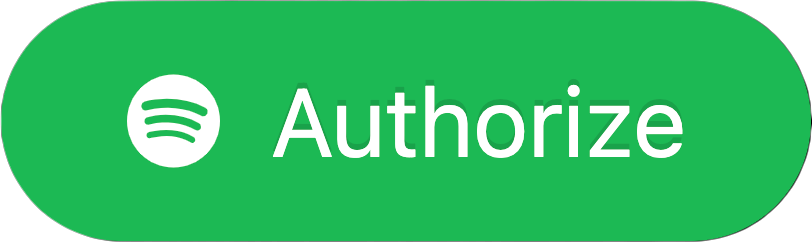

# Spotify Recently Played Tracks
Add your recently played tracks on Spotify to your website/profile. Supported by [Vercel](https://vercel.com).

## • SECTION 1: Getting Started
Click the "Authorize" button below to connect your Spotify account. This is necessary to access your recently played tracks.

> By authorizing the app, you allow your Spotify username, access token, and refresh token to be securely stored in a Google Firebase database. This allows the app to automatically refresh your access token and requires authorization only once.
>
> You can revoke the app's access to your data at https://www.spotify.com/account/apps.

<a href="https://spotify.mdusova.com/"></a>

After authorizing, add the following code to your website/profile and replace the xxxxx in the `?user=xxxxx` parameter with your Spotify username.

#### + To add in Markdown:
```md

```
#### + To add in HTML:
```md

```


## SECTION 2: Adjusting the Number of Tracks in the List
To adjust the number of tracks in the list, add `&count=x` to the API URL. The values for `x` can be:

> Default: `5`  
> Minimum: `1`  
> Maximum: `10`

#### + To add in Markdown:
ℹ️ Don't forget to adjust the `?user=` parameter with your own username!
```md

```
#### + To add in HTML:
ℹ️ Don't forget to adjust the `?user=` parameter with your own username!
```md

```


## • SECTION 2.1: Adjusting the Width of the List
To adjust the width of the list, add `&width=xxx` to the API URL. The values for `xxx` can be:

> Default: `400`  
> Minimum: `300`  
> Maximum: `1000`

#### + To add in Markdown:
ℹ️ Don't forget to adjust the `?user=` parameter with your own username!
```md

```
#### + To add in HTML:
ℹ️ Don't forget to adjust the `?user=` parameter with your own username!
```md

```


## • SECTION 2.2: Showing Repeated Tracks in the List
To show repeated tracks in the list, add `&unique=true` to the API URL.

> By default, it is not included in the URL, meaning repeated tracks will not be shown in the list.
> When you add `&unique=true` to the API URL, you will see repeated tracks in the list.

#### + To add in Markdown:
ℹ️ Don't forget to adjust the `?user=` parameter with your own username!
```md

```
#### + To add in HTML:
ℹ️ Don't forget to adjust the `?user=` parameter with your own username!
```md

```


## • SECTION 2.3: Using the Settings Tab with a User-Friendly Interface to Adjust List Width, Number of Tracks, and Track Uniqueness

> With the new user-friendly interface, you can easily adjust the list width, number of tracks, and repeated tracks without providing any values in the URL.

## • SECTION 3: Create Your Own App on Vercel
[](https://vercel.com/new/git/external?repository-url=https%3A%2F%2Fgithub.com%2Fmadtethys%2Fspotify-son-dinlenenler&env=NEXT_PUBLIC_CLIENT_ID,NEXT_PUBLIC_BASE_URL,NEXT_PUBLIC_REDIRECT_URI,CLIENT_SECRET,FIREBASE_PROJECT_ID,FIREBASE_PRIVATE_KEY_B64,FIREBASE_CLIENT_EMAIL)

Use the link above to create your own app. Then, set the following environment variables:

| Variable | Description |
|---|---|
| `NEXT_PUBLIC_REDIRECT_URI` | Spotify callback URI http://yourdomain.com/api/callback |
| `NEXT_PUBLIC_BASE_URL` | Project URL |
| `NEXT_PUBLIC_CLIENT_ID` | Spotify application client ID |
| `CLIENT_SECRET` | Spotify application client secret |
| `FIREBASE_PROJECT_ID` | Firebase project ID |
| `FIREBASE_PRIVATE_KEY_B64` | Base64 encoded private key of Firebase system user |
| `FIREBASE_CLIENT_EMAIL` | Firebase system user email |
| `FIREBASE_DATABASE_URL` | Firebase database URL |

Finally, edit the `utils/Constants.ts` file and set the `ClientId`, `BaseUrl`, `RedirectUri` values.

## • SECTION 4: Running Locally
1. Clone the project with Git:
    ```sh
    $ git clone https://github.com/madtethys/spotify-son-dinlenenler.git
    ```
2. Install the node modules:
    ```sh
    $ npm install
    ```
3. Create a `.env` file with the necessary environment variables:
    ```sh
    NEXT_PUBLIC_REDIRECT_URI=<Spotify callback URI http://localhost:3000/api/callback>
    NEXT_PUBLIC_BASE_URL=<Project URL for local run (http://localhost:3000)>
    NEXT_PUBLIC_CLIENT_ID=<Spotify application client ID>
    CLIENT_SECRET=<Spotify application client secret>
    FIREBASE_PROJECT_ID=<Firebase project ID>
    FIREBASE_PRIVATE_KEY_B64=<Base64 encoded private key of Firebase system user>
    FIREBASE_CLIENT_EMAIL=<Firebase system user email>
    FIREBASE_DATABASE_URL=<Firebase database URL>
    ```
4. Edit the `utils/Constants.ts` file and set the `ClientId`, `BaseUrl`, `RedirectUri` values.
5. Start the project:
    ```sh
    $ npm run dev
    ```

📍 Your application will be running at [http://localhost:3000](http://localhost:3000).

## • SECTION 5: Frequently Asked Questions
#### ❓ QUESTION: The widget is not loading on GitHub.
✔️ Sometimes the widget does not load on GitHub and you may receive a 502 response from `camo.githubusercontent.com`. This happens because GitHub proxies images and long requests may time out. Long request times are usually due to the **server distance** of the Firebase database, which can take a few seconds. If the image still does not load after refreshing the page, you can recreate your Firebase project with another Google account.

ℹ️ This may **not** be a **definite** solution and **may not completely eliminate** the issue. If you have better solutions or general optimizations, feel free to share them with me!

#### ❓ QUESTION: What is the Spotify application client ID?
✔️ The Spotify application client ID is the ID of the application you created on Spotify. This ID is used to identify your application on Spotify and should be set in the `NEXT_PUBLIC_CLIENT_ID` environment variable.

#### ❓ QUESTION: What is the Spotify application client secret?
✔️ The Spotify application client secret is the secret key of the application you created on Spotify. This key is used to identify your application on Spotify and should be set in the `CLIENT_SECRET` environment variable.

#### ❓ QUESTION: What is the Firebase project ID?
✔️ The Firebase project ID is the ID of the project you created on Firebase. This ID is used to identify your project on Firebase and should be set in the `FIREBASE_PROJECT_ID` environment variable.

#### ❓ QUESTION: What is the base64 encoded private key of the Firebase system user?
✔️ The base64 encoded private key of the Firebase system user is the base64 encoded version of the private key of the project you created on Firebase. This key is used to identify your project on Firebase and should be set in the `FIREBASE_PRIVATE_KEY_B64` environment variable.

#### ❓ QUESTION: What is the Firebase system user email?
✔️ The Firebase system user email is the email of the system user of the project you created on Firebase. This email is used to identify your project on Firebase and should be set in the `FIREBASE_CLIENT_EMAIL` environment variable.

#### ❓ QUESTION: What is the Firebase database URL?
✔️ The Firebase database URL is the URL of the database of the project you created on Firebase. This URL is used to identify your project on Firebase and should be set in the `FIREBASE_DATABASE_URL` environment variable.

## • SECTION 6: Added Features

#### 🌙 Dark Theme (v0.9.4-beta.2):
> We have added dark theme support to further enhance the user experience! We aim to reduce eye strain by providing a more suitable interface for night use. The dark mode will help users have a more comfortable experience.

#### ⚙️ Settings Tab (v0.9.5-beta.2):
> You no longer need to deal with the API URL, you can now easily make adjustments from the settings tab. With this new feature, you can obtain the URL more simply and quickly, and manage all configurations from one place. With our user-friendly interface, you can easily configure the settings you want and personalize your API experience. Save time by updating all your settings with a single click!

#### 🔗 Adding to Instagram Story (v0.9.9-beta.4):
> We have added the feature to share the image obtained from the API on Instagram stories! Now you can easily share your recently played tracks in your story. Moreover, you have the option to change the background of the image while sharing. Thus, you can present your music in a more unique way and create an aesthetic that suits your style.

#### 📶 Real-Time Data Fetching (v1.0.0-alpha):
> Our project is now completely moved to Turkish servers! This allows us to achieve 100% real-time data fetching capacity. Previous latency issues were due to the project being hosted on [Vercel](https://vercel.com/)'s Europe-West1 (Ireland) and [Firebase Database](https://firebase.google.com/)'s Europe-West1 (Belgium) servers.

> Now our real-time data fetching performance has significantly improved, and we continue to work on further enhancing the user experience.

## • SECTION 7: Privacy Policy
You can read the privacy policy [here](./privacy-policy.md).

## • SECTION 8: License
This project is licensed under the [Apache License 2.0](LICENSE). For more information, please refer to the license file.
